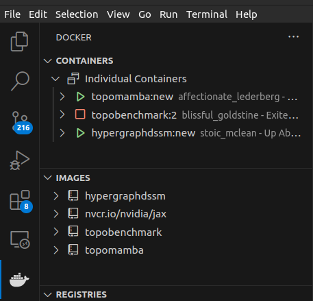

# TopoMamba

## Initialize Docker 

Navigate to the TopoMamba directory
```
cd /path/to/TopoMamba
```
Build Docker image
```
docker build -t topomamba:new .
```

Now that the image is built you can run one of these commands to create the container.

**With GPUs**
```
docker run -it -d --gpus all --volume $(pwd):/TopoMamba topomamba:new
```

**Without GPUs**
```
docker run -it -d --volume $(pwd):/TopoMamba topomamba:new
```

## Use Docker with VSCode

After having created the Docker container, if you have installed the Docker extension in VSCode you should see the container in the Docker tab on the left. Right-click the container name and select **Attach Visual Studio Code**. 

It should open a new window. If it asks you to select a folder you should choose */TopoMamba/*. This is the path to the folder we created inside Docker, not to the cloned repo. 


